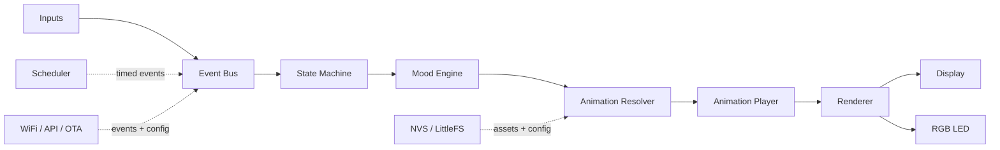

# DeskBot Documentation

DeskBot is a small desktop companion built around an ESP-class microcontroller, a compact display, touch input, presence detection, weather/time data, and personality-driven animations.

This repository is intentionally plain Markdown. It does not contain a website framework, build system, package manager setup, or generated documentation app.

> **Inferred from source material:** The same concept appeared in the original notes as **Expression Bot**, **RobotBuddy**, and **DeskBot**. These documents use **DeskBot** as the canonical project name and treat the other names as earlier working names.

## Documents

| File | Purpose |
| --- | --- |
| [`product.md`](product.md) | Product purpose, V1 scope, user interactions, provisioning, and commercial notes. |
| [`architecture.md`](architecture.md) | System architecture, runtime flow, state/mood model, and design decisions. |
| [`firmware.md`](firmware.md) | Firmware module responsibilities, target project structure, renderer/page model, and prototype migration notes. |
| [`hardware.md`](hardware.md) | Hardware recommendations, display/sensor choices, BOM, power constraints, and pricing placeholders. |
| [`roadmap.md`](roadmap.md) | Phased implementation plan, testing strategy, future plugins, and known documentation gaps. |

## V1 scope summary

| Area | V1 decision |
| --- | --- |
| MCU | ESP32-C3 Super Mini target; ESP8266 prototype exists as reference only. |
| Development display | SH1106 OLED, typically 128×64. |
| Future display | GC9A01 round TFT support through renderer abstraction. |
| Inputs | Touch sensor and presence sensor. |
| Outputs | Display and single RGB LED. |
| Connectivity | WiFi, local configuration portal, cloud-ready config sync, OTA path. |
| Core features | Robot eyes, clock/date, weather, thought of the day, animation viewer, system page, WiFi setup, OTA. |

## Architecture at a glance

## Consolidation notes

The original repository contained duplicate explanations of the same product flow: inputs → events → state machine → animation resolver → renderer → display/RGB output. That repeated content has been consolidated into a small set of Markdown files.

Normalized decisions:

- **Product name:** use DeskBot consistently.
- **Hardware target:** ESP32-C3 is the V1 target; the ESP8266 sketch remains useful as prototype reference.
- **Long press:** use a 4-second long press for the system page. The earlier prototype used a shorter 1.5-second hold for convenience.
- **Sensor options:** RCWL-0516 is the low-cost presence option; VL53L0X, LD2410, and LD2450 are upgrade paths.
- **Personality options:** use safe persona categories such as Friendly, Calm, Focused, or Playful.

## What this repo is not

This repo is not currently:

- A deployable documentation website.
- A Next.js/Nextra project.
- A firmware implementation.
- A validated production BOM.
- A final schematic or PCB package.
