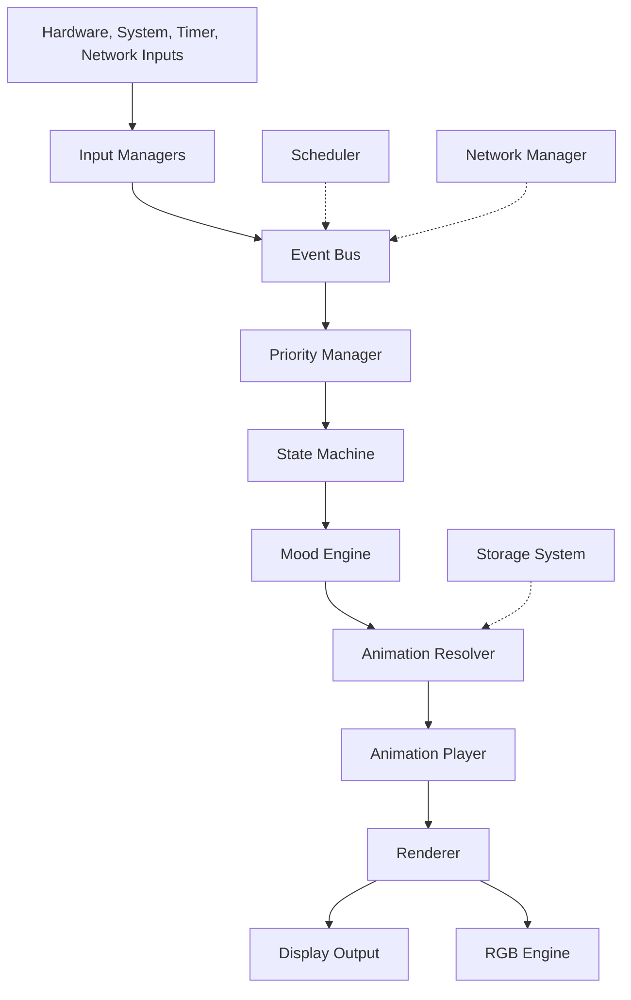

# System Architecture

DeskBot should be built as a product-quality embedded system, not as a growing monolithic Arduino sketch. The core architecture is a layered event-driven pipeline.

## Canonical pipeline



## Layer responsibilities

| Layer | Responsibility | Must not do |
| --- | --- | --- |
| Input managers | Convert hardware/software signals into events | Trigger animations or draw UI directly |
| Event bus | Standardize communication between modules | Encode business logic |
| Priority manager | Resolve competing states | Render or mutate hardware directly |
| State machine | Decide the active state | Know display driver details |
| Mood engine | Maintain longer-term personality variables | Replace explicit system states |
| Animation resolver | Choose the animation to play | Draw frames |
| Animation player | Sequence frames with timing and interruption rules | Choose product state |
| Renderer | Convert frames and primitives into pixels | Know emotions, touch, or business logic |
| RGB engine | Express ambient LED behavior | Become a second state machine |
| Scheduler | Generate timed events | Block the main loop |
| Network manager | WiFi, REST/WebSocket, heartbeat, OTA/config events | Directly control UI |
| Storage | Persist credentials, config, and assets | Own runtime behavior |

## Boot-to-runtime flow

1. Device powers on through USB-C, battery, reset, or a development cable.
2. Bootloader validates firmware and falls back to rollback or recovery if needed.
3. System initializes serial debug, heap tracking, NVS, LittleFS, display, LVGL or rendering library, RGB LED, input managers, scheduler, state machine, WiFi, API client, and OTA service.
4. Config loader reads credentials, token, personality, brightness, paired-bot data, last state, and animation packs.
5. If unprovisioned, the bot enters pairing mode.
6. If provisioned, the bot starts normal runtime: scheduler, mood engine, state machine, idle personality, animation loop, rendering, and background services.

## Main loop target

The ideal runtime target is **30 FPS**, or roughly a 33 ms loop budget.

Each tick should:

1. Poll inputs.
2. Process pending events.
3. Update state and mood.
4. Resolve the active animation.
5. Render a frame.
6. Flush display changes.
7. Update LED state.
8. Run non-blocking background work.

## Why event-driven architecture matters

Without an event bus, touch handling, WiFi, weather, animation, and display code quickly become tightly coupled. The event-driven model keeps each module testable and replaceable.

Bad coupling:

```cpp
touchManager.onTap([]() {
  animationEngine.play("excited");
  display.drawBitmap(...);
});
```

Preferred pattern:

```cpp
eventBus.emit(Event::TouchSingle);
// State machine and resolver decide what happens next.
```
