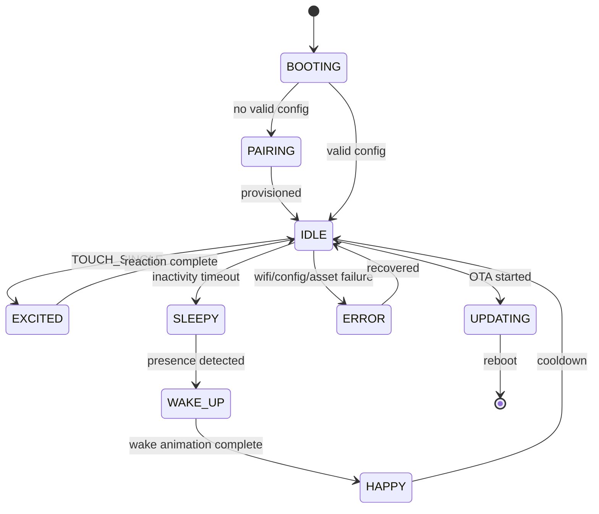

# Runtime Flow

This page documents what happens while DeskBot is running normally.

## Event categories

| Category | Example events |
| --- | --- |
| Physical | `TOUCH_SINGLE`, `TOUCH_DOUBLE`, `TOUCH_LONG`, `PRESENCE_DETECTED`, `CHARGING_STARTED` |
| System | `BOOT_COMPLETE`, `LOW_MEMORY`, `DISPLAY_READY`, `CONFIG_LOADED` |
| Timer | `BLINK_TRIGGER`, `INACTIVITY_TIMEOUT`, `RANDOM_IDLE`, `SLEEP_WINDOW_STARTED` |
| Network | `WIFI_CONNECTED`, `WIFI_DISCONNECTED`, `CONFIG_UPDATED`, `OTA_AVAILABLE` |
| Asset | `ANIMATION_PACK_LOADED`, `ASSET_MISSING`, `ASSET_CACHE_FULL` |

## Example state transition

## Mood variables

Mood is not the same as state. State is what the bot is doing now; mood is a slower-moving set of personality variables that influences presentation.

| Variable | Meaning | Increases when | Decreases when |
| --- | --- | --- | --- |
| Happiness | Positive affect | Friendly interaction, clear weather | Repeated errors, spam tapping |
| Energy | Activity level | Recent wake, charging, daytime | Sleep window, inactivity |
| Excitement | Short-term reaction intensity | Touch, presence, new content | Cooldown |
| Boredom | Need for variety | Long idle time | Page change, interaction |
| Attention | User engagement | Presence, touch | No presence |

## Animation resolution rules

| Condition | Resolved animation |
| --- | --- |
| `IDLE + happy` | `idle_soft_blink` or bouncing eyes |
| `IDLE + sleepy` | `idle_slow_blink` |
| `TOUCH_SINGLE` from idle | `touch_excited_reaction` |
| WiFi connecting | `system_thinking` |
| WiFi error | `system_error_sad` |
| OTA updating | `system_update_progress` |

## Background services

| Service | Typical interval | Output |
| --- | ---: | --- |
| Blink scheduler | 5–12 seconds | `BLINK_TRIGGER` |
| Idle reaction scheduler | 2 minutes | `RANDOM_IDLE` |
| Config sync | 5 minutes | `CONFIG_UPDATED` when changed |
| WiFi reconnect | 30 seconds when disconnected | Network events |
| OTA checker | Product-defined | `OTA_AVAILABLE` or no-op |
