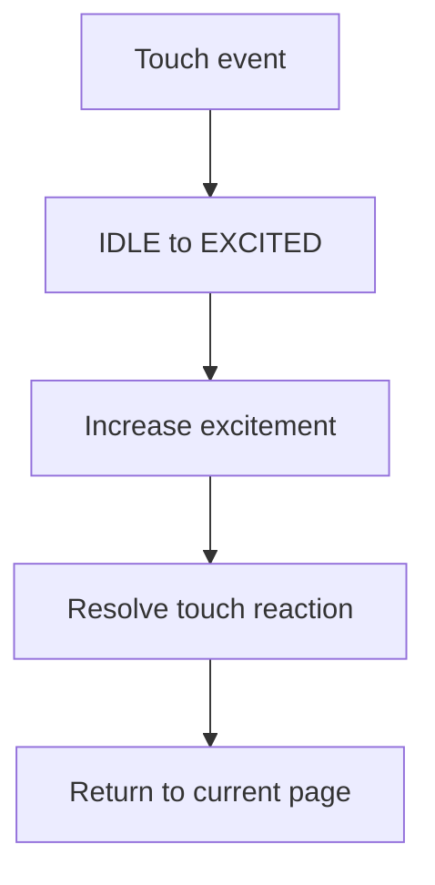

# Build the V1 Skeleton

Start by creating a clean skeleton before adding feature complexity. This gives the project room to scale without turning into a single sketch.

## Phase 1: Lock scope

Build only:

1. Robot eyes.
2. Clock and date.
3. Weather.
4. Thought of the day.
5. GIF / animation viewer.
6. System page.
7. WiFi configuration portal.
8. OTA update path.

Everything else is a plugin candidate.

## Phase 2: Create core interfaces

Define the interfaces first:

- `EventBus`
- `StateMachine`
- `Scheduler`
- `Renderer`
- `IPage`
- `PageManager`
- `ConfigManager`

## Phase 3: Build minimal pages

Start with placeholder rendering and add data later.

| Page | First implementation |
| --- | --- |
| Eyes | Draw neutral eyes and blink timer |
| Weather | Show city and “loading” state |
| Thought | Show one local phrase |
| System | Show firmware version, WiFi status, uptime |

## Phase 4: Add services

Bring in services one at a time:

1. WiFi manager.
2. Time sync.
3. Weather service.
4. Storage/config.
5. Config portal.
6. OTA.

## Phase 5: Add personality

After pages work, add mood and animation resolution.



## Phase 6: Prepare plugins

Future plugins should only need:

```cpp
init();
update();
render(renderer);
name();
```

A disabled plugin should not affect firmware boot, page navigation, or memory budgets.
