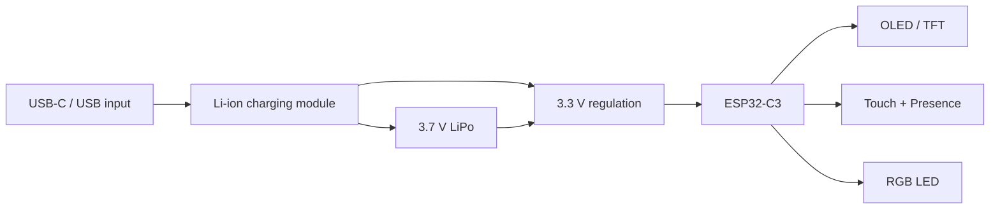

# Hardware Guide

DeskBot hardware is intentionally modular: the same firmware architecture should support a low-cost square OLED version and a higher-impact round display version.

## Recommended V1 hardware

| Component | V1 recommendation | Alternatives / notes |
| --- | --- | --- |
| MCU | ESP32-C3 Super Mini | Prototype code used ESP8266 NodeMCU |
| Display | SH1106 OLED for development | GC9A01 round TFT and ST77916 round TFT as future options |
| Input | Capacitive touch sensor | Physical button can be used during development |
| Presence | RCWL-0516 for low cost | VL53L0X ToF, LD2410, or LD2450 for better sensing |
| LED | Single RGB LED | Use as ambient mood output |
| Power | USB-C input | Battery support via Li-ion charger module |
| Battery | 3.7 V LiPo around 200 mAh | Capacity depends on display brightness and sleep behavior |
| Storage | Internal flash with NVS/LittleFS | External storage not required for V1 |

## Hardware constraints

| Constraint | Impact |
| --- | --- |
| RAM is limited | Avoid large uncompressed animations in RAM; stream frames or cache carefully |
| Flash is limited | Keep assets compressed and versioned |
| Display bandwidth is limited | Prefer dirty rectangles or partial redraws when supported |
| Battery is small | Sleep mode, dimming, and WiFi duty cycle matter |
| Sensor false positives | Debounce touch and gate presence events through cooldowns |

## Display options

| Display | Resolution | Pros | Cons |
| --- | ---: | --- | --- |
| SH1106 OLED | 128×64 | Cheap, simple, low-power, great for eyes | Monochrome, limited UI richness |
| 1.8-inch SPI TFT | Varies | Color and larger dashboard surface | More power, more rendering work |
| GC9A01 round TFT | 240×240 | Strong visual identity for a desk bot | Higher cost and more bandwidth |
| ST77916 round TFT | 360×360 | Sharper premium look | Higher memory/bandwidth requirements |

## Presence sensor tradeoffs

| Sensor | Use case | Tradeoff |
| --- | --- | --- |
| RCWL-0516 | Lowest-cost motion/presence wake | Can be noisy and less precise |
| VL53L0X | Short-range distance sensing | Needs line of sight; better for desk proximity |
| LD2410 / LD2450 | More advanced human-presence sensing | Higher cost and integration complexity |

## Power architecture

> **Known limitation:** the source notes list modules and estimated prices but do not include a final schematic, pin map, regulator choice, charge-current validation, or battery runtime calculation.
