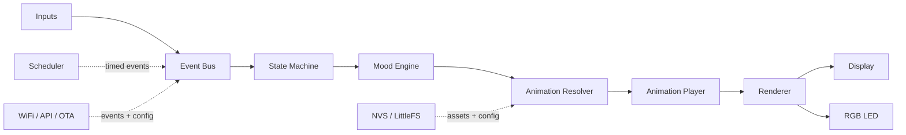

# DeskBot / Expression Bot Knowledge Base

DeskBot is a small desktop companion built around an ESP-class microcontroller, a compact display, touch input, presence detection, weather/time data, and personality-driven animations. This documentation consolidates the original product notes, architecture sketches, hardware resources, implementation plan, and prototype firmware into a single professional knowledge base.

> **Inferred from source material:** The same concept appears under the names **Expression Bot**, **RobotBuddy**, and **DeskBot**. This site uses **DeskBot** as the product/documentation name and treats **Expression Bot** and **RobotBuddy** as earlier working names.

## What DeskBot does

DeskBot is designed to feel like a living desk pet rather than a passive information display. It shows expressive eyes, clock/date, weather, thoughts, GIFs or frame animations, and system status. Touch and presence events influence its emotional state and animations.

## V1 scope

| Area | V1 decision |
| --- | --- |
| MCU | ESP32-C3 Super Mini target; ESP8266 prototype exists |
| Development display | 0.96-inch / 1.3-inch SH1106 OLED |
| Future display | GC9A01 round TFT support through renderer abstraction |
| Inputs | Touch sensor; presence sensor |
| Outputs | Display and single RGB LED |
| Connectivity | WiFi, local configuration portal, cloud-ready config sync |
| Core features | Robot eyes, clock/date, weather, thought of the day, animation viewer, system page, WiFi setup, OTA |

## Recommended reading order

1. [Product Brief](/product) — understand the product and user experience.
2. [System Architecture](/architecture) — learn the layered architecture.
3. [Firmware Guide](/firmware) — see how firmware modules map to the architecture.
4. [Hardware Guide](/hardware) — review components and constraints.
5. [Build the V1 Skeleton](/guides/implementation) — start implementation.

## Architecture at a glance

## Documentation consolidation notes

The original files contained duplicated explanations of the same flow: inputs → events → state machine → animation resolver → renderer → outputs. This site keeps one canonical explanation in the architecture section and moves implementation-specific notes into firmware pages.

Outdated or conflicting items were normalized:

- **Long press duration:** product interaction notes used 4 seconds, prototype firmware used 1.5 seconds. V1 documentation standardizes on **4 seconds** for the system page because it is less likely to be triggered accidentally.
- **Hardware platform:** planning notes target ESP32-C3; prototype code targets ESP8266 NodeMCU. V1 documentation treats ESP32-C3 as the target and the ESP8266 sketch as a reference prototype.
- **Sensor naming:** notes mention RCWL-0516, VL53L0X, LD2410, and LD2450. V1 defines RCWL-0516 as the low-cost option and VL53L0X/LD2410/LD2450 as upgrade paths.
