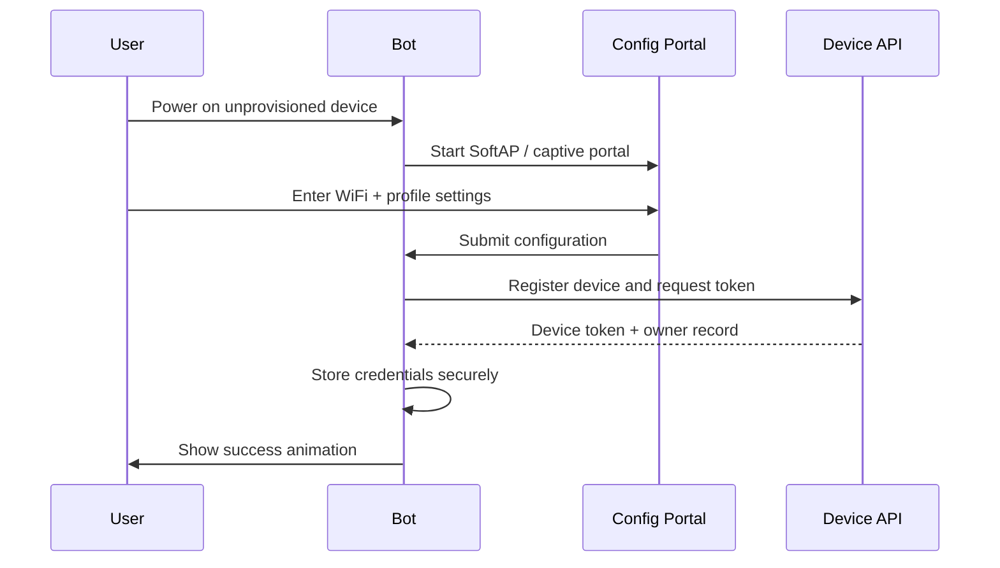

# Provisioning & Configuration

Provisioning gives the device enough local configuration to join WiFi, identify itself, and start the correct personality experience.

## First-run flow

## Initial configuration fields

| Field | Required | Notes |
| --- | --- | --- |
| User name or pet name | Yes | Used for personalized messages |
| Bot name | Yes | Device identity in UI and backend |
| Personality | Yes | Original notes listed unsafe examples; use safe product personas such as Friendly, Calm, Focused, or Playful |
| Location | Yes | City or latitude/longitude for weather |
| User-selected gender/persona styling | Optional | Treat as cosmetic; avoid sensitive assumptions |
| Mode preset | Optional | Happy, Focus, Sleepy, etc. |
| Enabled pages | Optional | Example: enable/disable news |

## Pre-provisioning restrictions

Before provisioning completes, the bot should only allow setup-related actions. Do not expose editable runtime settings, plugin controls, OTA channels, or account-linked screens until the device has valid credentials.

## Storage model

| Storage | Use |
| --- | --- |
| NVS / preferences | WiFi credentials, device token, owner ID, small user preferences |
| LittleFS | Assets, cached configuration, frame packs, static web portal resources |
| Runtime RAM | Current mood, state, timers, page index, animation buffers |

## Security notes

- Never hard-code production WiFi credentials into firmware.
- Store tokens in the smallest practical scope and avoid serial-printing secrets.
- Use HTTPS for backend registration when the target MCU and memory budget allow it.
- Expose a safe factory reset path for transferring ownership.
