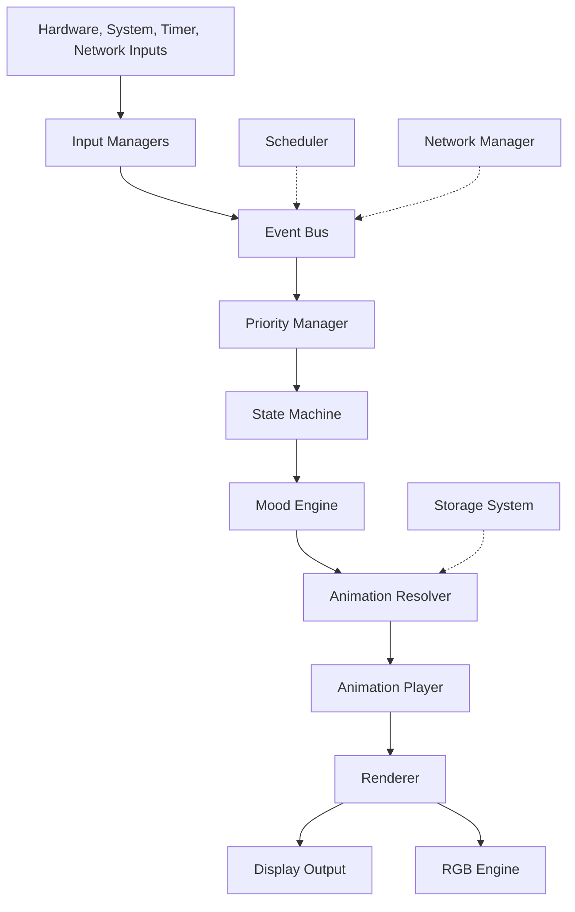
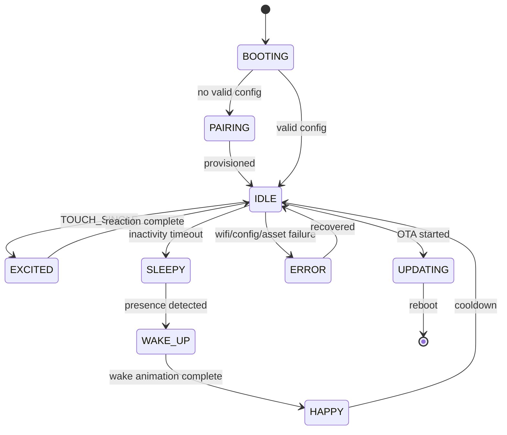

# Architecture

DeskBot should be built as a product-quality embedded system, not as a growing monolithic Arduino sketch. The core architecture is a layered, event-driven pipeline.

## Canonical pipeline



## Layer responsibilities

| Layer | Responsibility | Must not do |
| --- | --- | --- |
| Input managers | Convert hardware/software signals into events. | Trigger animations or draw UI directly. |
| Event bus | Standardize communication between modules. | Encode business logic. |
| Priority manager | Resolve competing states. | Render or mutate hardware directly. |
| State machine | Decide the active state. | Know display driver details. |
| Mood engine | Maintain longer-term personality variables. | Replace explicit system states. |
| Animation resolver | Choose the animation to play. | Draw frames. |
| Animation player | Sequence frames with timing and interruption rules. | Choose product state. |
| Renderer | Convert frames and primitives into pixels. | Know emotions, touch, or business logic. |
| RGB engine | Express ambient LED behavior. | Become a second state machine. |
| Scheduler | Generate timed events. | Block the main loop. |
| Network manager | WiFi, REST/WebSocket, heartbeat, OTA/config events. | Directly control UI. |
| Storage | Persist credentials, config, and assets. | Own runtime behavior. |

## Boot-to-runtime flow

1. Device powers on through USB-C, battery, reset, or development cable.
2. Bootloader validates firmware and falls back to rollback or recovery if needed.
3. System initializes serial debug, heap tracking, NVS, LittleFS, display, rendering library, RGB LED, input managers, scheduler, state machine, WiFi, API client, and OTA service.
4. Config loader reads credentials, token, personality, brightness, paired-bot data, last state, and animation packs.
5. If unprovisioned, the bot enters pairing mode.
6. If provisioned, the bot starts normal runtime: scheduler, mood engine, state machine, idle personality, animation loop, rendering, and background services.

## Main loop target

The ideal runtime target is **30 FPS**, or roughly a 33 ms loop budget.

Each tick should:

1. Poll inputs.
2. Process pending events.
3. Update state and mood.
4. Resolve the active animation.
5. Render a frame.
6. Flush display changes.
7. Update LED state.
8. Run non-blocking background work.

## Event categories

| Category | Example events |
| --- | --- |
| Physical | `TOUCH_SINGLE`, `TOUCH_DOUBLE`, `TOUCH_LONG`, `PRESENCE_DETECTED`, `CHARGING_STARTED`. |
| System | `BOOT_COMPLETE`, `LOW_MEMORY`, `DISPLAY_READY`, `CONFIG_LOADED`. |
| Timer | `BLINK_TRIGGER`, `INACTIVITY_TIMEOUT`, `RANDOM_IDLE`, `SLEEP_WINDOW_STARTED`. |
| Network | `WIFI_CONNECTED`, `WIFI_DISCONNECTED`, `CONFIG_UPDATED`, `OTA_AVAILABLE`. |
| Asset | `ANIMATION_PACK_LOADED`, `ASSET_MISSING`, `ASSET_CACHE_FULL`. |

## State transition example



## Mood variables

Mood is not the same as state. State is what the bot is doing now; mood is a slower-moving set of personality variables that influences presentation.

| Variable | Meaning | Increases when | Decreases when |
| --- | --- | --- | --- |
| Happiness | Positive affect. | Friendly interaction, clear weather. | Repeated errors, spam tapping. |
| Energy | Activity level. | Recent wake, charging, daytime. | Sleep window, inactivity. |
| Excitement | Short-term reaction intensity. | Touch, presence, new content. | Cooldown. |
| Boredom | Need for variety. | Long idle time. | Page change, interaction. |
| Attention | User engagement. | Presence, touch. | No presence. |

## Priority model

Not all modes are equal. A WiFi error or OTA update must override a decorative page.

| Priority | Category | Examples |
| ---: | --- | --- |
| 100 | OTA / critical update | Firmware flashing, reboot required. |
| 90 | Pairing | Captive portal active, waiting for WiFi. |
| 80 | Error | WiFi failed, low memory, asset missing. |
| 70 | User interaction | Touch reaction, page change. |
| 60 | Network | Config updated, reconnecting. |
| 50 | Mood | Happy, sleepy, annoyed. |
| 20 | Idle | Blinking, soft idle animations. |
| 10 | Sleep | Display dim/off, slow breathing LED. |

## Animation resolution rules

| Condition | Resolved animation |
| --- | --- |
| `IDLE + happy` | `idle_soft_blink` or bouncing eyes. |
| `IDLE + sleepy` | `idle_slow_blink`. |
| `TOUCH_SINGLE` from idle | `touch_excited_reaction`. |
| WiFi connecting | `system_thinking`. |
| WiFi error | `system_error_sad`. |
| OTA updating | `system_update_progress`. |

## Design decisions

### Renderer abstraction

Pages must never call display-driver APIs directly.

Use:

```cpp
renderer.drawText(...);
renderer.drawBitmap(...);
renderer.drawCircle(...);
```

Avoid direct page dependencies on `Adafruit_SH110X`, `TFT_eSPI`, `U8G2`, or `LovyanGFX`.

### Small V1 page set

V1 includes robot eyes, clock/date, weather, thought, GIF/animation viewer, system page, WiFi configuration portal, and OTA. News, stocks, horoscope, sports, and social counters should be plugins later.

### Event bus separation

Inputs, network events, timers, and sensors emit events. They do not call animation or rendering systems directly.

Bad coupling:

```cpp
touchManager.onTap([]() {
  animationEngine.play("excited");
  display.drawBitmap(...);
});
```

Preferred pattern:

```cpp
eventBus.emit(Event::TouchSingle);
// State machine and resolver decide what happens next.
```

### Personality state outranks dashboard content

The display should reflect the bot's state first and information second. Product differentiation comes from the feeling of a living companion.

### ESP32-C3 target

Use ESP32-C3 for V1 architecture and treat the ESP8266 NodeMCU code as a reference sketch.
