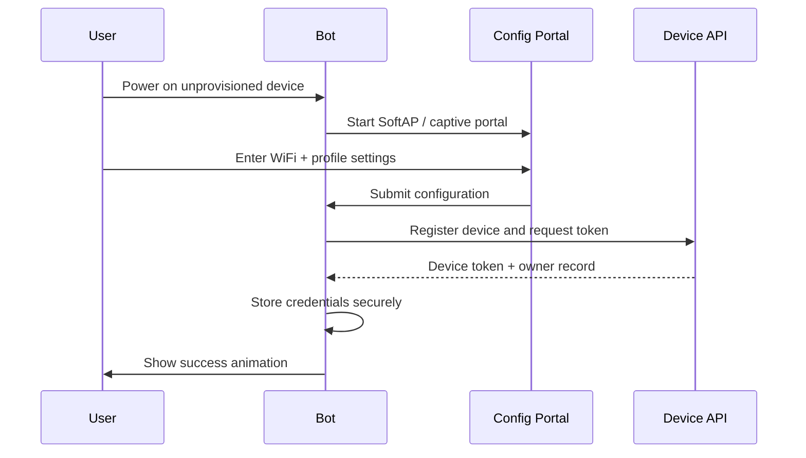

# Product Definition

DeskBot is a personality-first IoT desk companion. It combines practical information screens with expressive behavior so the device feels present, reactive, and playful rather than like a passive dashboard.

## Why this exists

Most small maker displays become a sequence of static information pages. DeskBot intentionally reverses that priority:

1. **Emotion first** — the bot should feel alive.
2. **Information second** — weather, time, and other content should appear through a personality layer.
3. **Plugins later** — avoid overloading V1 with too many dashboards.

## Target users

| User | Needs |
| --- | --- |
| Makers | A modular ESP-based firmware architecture they can extend. |
| Desk workers | Ambient time/weather/status without opening a phone. |
| Hobby product builders | A low-cost BOM with clear upgrade paths. |
| Developers | A plugin-style page model and clean module boundaries. |

## Product principles

- Keep interaction simple: one touch surface and presence detection.
- Avoid menu trees, many buttons, and complicated gestures in V1.
- Keep firmware modular so features can become pages/plugins.
- Let personality influence how information appears.
- Protect small-device limits: RAM, flash, frame timing, display bandwidth, and battery budget.

## Canonical V1 feature set

| Feature | Included in V1? | Notes |
| --- | --- | --- |
| Robot eyes | Yes | Core personality surface. |
| Clock and date | Yes | Uses NTP when WiFi is available. |
| Weather | Yes | Prototype used Open-Meteo current weather. |
| Thought of the day | Yes | Local random thoughts initially. |
| GIF / animation viewer | Yes | Frame animation support; exact format still TBD. |
| System page | Yes | Shown on boot, WiFi changes, errors, and long press. |
| WiFi configuration portal | Yes | Local portal during setup or config changes. |
| OTA updates | Yes | Architecture-required; implementation can arrive after skeleton. |
| News, stocks, horoscope, cricket, social stats | Later | Plugin candidates, not V1 core. |
| Messaging connected bots | Later | Requires backend, identity, pairing, and privacy model. |

## User interaction model

| Action | Result | Rationale |
| --- | --- | --- |
| Single tap | Next page | Primary navigation action. |
| Double tap | Previous page | Secondary navigation without extra buttons. |
| Long press, 4 seconds | System page | Reduces accidental activation. |
| Presence detected | Wake animation | Makes the bot acknowledge the user. |
| No presence for 5 minutes | Sleep mode | Saves power and reinforces personality. |

## Core modes

| Mode | Purpose | Key data |
| --- | --- | --- |
| Robot Eyes | Default emotional surface. | Mood, animation, blink timing. |
| Weather | Local weather dashboard. | City, date, weather icon, temperature, wind speed. |
| Thought | Ambient short phrase. | Local or remote thought string. |
| GIF / Animation | Playful media viewer. | Stored frame pack or GIF-like sequence. |
| System | Health and diagnostics. | WiFi, uptime, heap, IP, update state. |

## Optional plugin modes

These ideas are useful, but they should remain outside V1 until the core platform is stable:

- News by city or topic.
- Stock watchlist for up to five symbols.
- Daily horoscope by zodiac sign.
- Auto-play mini-game.
- YouTube or Instagram counters.
- Cricket match score.
- Connected-bot messaging.
- Meme/photo page.

## Provisioning flow

Provisioning gives the device enough local configuration to join WiFi, identify itself, and start the correct personality experience.

## Initial configuration fields

| Field | Required | Notes |
| --- | --- | --- |
| User name or pet name | Yes | Used for personalized messages. |
| Bot name | Yes | Device identity in UI and backend. |
| Personality | Yes | Use safe personas such as Friendly, Calm, Focused, or Playful. |
| Location | Yes | City or latitude/longitude for weather. |
| User-selected gender/persona styling | Optional | Treat as cosmetic; avoid sensitive assumptions. |
| Mode preset | Optional | Happy, Focus, Sleepy, etc. |
| Enabled pages | Optional | Example: enable/disable news. |

Before provisioning completes, the bot should only allow setup-related actions. Do not expose editable runtime settings, plugin controls, OTA channels, or account-linked screens until the device has valid credentials.

## Storage model

| Storage | Use |
| --- | --- |
| NVS / preferences | WiFi credentials, device token, owner ID, small user preferences. |
| LittleFS | Assets, cached configuration, frame packs, static web portal resources. |
| Runtime RAM | Current mood, state, timers, page index, animation buffers. |

## Security notes

- Never hard-code production WiFi credentials into firmware.
- Store tokens in the smallest practical scope and avoid serial-printing secrets.
- Use HTTPS for backend registration when the target MCU and memory budget allow it.
- Expose a safe factory reset path for transferring ownership.

## Commercial target

The source notes estimated a low-cost consumer build using Indian component pricing.

| Variant | Estimated component + misc cost | Target selling price |
| --- | ---: | ---: |
| Square LED/OLED build | ₹1,600 | ₹1,800–₹2,000 |
| Round display build | ₹1,700 | ₹2,200 |

> **Known limitation:** prices in the source notes were not verified during this documentation pass and should be treated as procurement placeholders, not validated quotes.
