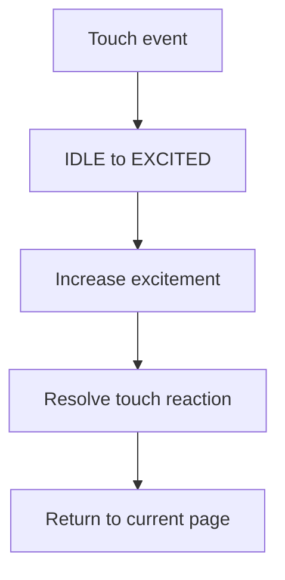

# Roadmap and Implementation Plan

This roadmap keeps the project focused on a stable V1 foundation before adding optional plugin modes.

## Phase 1: Lock V1 scope

Build only:

1. Robot eyes.
2. Clock and date.
3. Weather.
4. Thought of the day.
5. GIF / animation viewer.
6. System page.
7. WiFi configuration portal.
8. OTA update path.

Everything else is a plugin candidate.

## Phase 2: Create core interfaces

Define these interfaces before adding feature complexity:

- `EventBus`
- `StateMachine`
- `Scheduler`
- `Renderer`
- `IPage`
- `PageManager`
- `ConfigManager`

## Phase 3: Build minimal pages

Start with placeholder rendering and add data later.

| Page | First implementation |
| --- | --- |
| Eyes | Draw neutral eyes and blink timer. |
| Weather | Show city and loading state. |
| Thought | Show one local phrase. |
| System | Show firmware version, WiFi status, uptime. |

## Phase 4: Add services

Bring in services one at a time:

1. WiFi manager.
2. Time sync.
3. Weather service.
4. Storage/config.
5. Config portal.
6. OTA.

## Phase 5: Add personality

After pages work, add mood and animation resolution.



## Phase 6: Prepare plugins

Future plugins should only need:

```cpp
init();
update();
render(renderer);
name();
```

A disabled plugin should not affect firmware boot, page navigation, or memory budgets.

## Assets and animations

DeskBot's personality depends heavily on animation quality. Treat assets as a first-class subsystem.

| Category | Examples |
| --- | --- |
| Expressions | Happy eyes, sleepy eyes, wink, angry eyes. |
| Transitions | Wake up, fall asleep, touch reaction. |
| UI icons | WiFi, battery, weather, system state. |
| RGB profiles | Breathing, pulse, error flash, soft idle glow. |
| Frame packs | GIF-like loops or compressed frame sequences. |

Example animation metadata:

```json
{
  "id": "idle_soft_blink",
  "fps": 12,
  "loop": true,
  "interruptible": true,
  "priority": 20,
  "moods": ["happy", "idle"],
  "frames": ["000.bin", "001.bin", "002.bin"]
}
```

Playback rules:

- Idle animations should be interruptible.
- OTA/update animations should not be interrupted by normal user input.
- Touch reactions should return to the prior page or idle state.
- Missing assets should degrade to a safe built-in expression.
- Frame buffers should be sized for the display and memory budget.

## Firmware testing strategy

Test these modules without hardware where possible:

| Module | Test cases |
| --- | --- |
| Event bus | Subscribe, emit, dispatch order, queue overflow. |
| State machine | Touch transitions, sleep/wake transitions, error recovery. |
| Mood engine | Happiness/energy changes, saturation limits. |
| Scheduler | Blink ranges, inactivity timeout, reconnect interval. |
| Config manager | Defaults, invalid JSON, missing fields, save/load roundtrip. |
| Weather service | Code decoding, API error handling. |

## Hardware validation checklist

- Display initializes reliably after reset.
- Touch input is debounced and does not false-trigger during boot.
- Presence sensor does not keep the device awake forever in a noisy environment.
- WiFi reconnect does not block frame rendering.
- Sleep mode actually lowers current draw.
- Low battery or charger state is reflected safely if supported.
- OTA rollback path works before enabling automatic updates.

## Performance checks

| Metric | Target |
| --- | --- |
| Main loop | Non-blocking; visual target around 30 FPS. |
| Touch response | Feels immediate, ideally under 100 ms. |
| WiFi reconnect | Runs in background without freezing animations. |
| Asset load | No visible flicker or long blank screen. |
| Heap | No steady leak during page cycling. |

## Roadmap

### V1: Stable companion foundation

| Workstream | Deliverables |
| --- | --- |
| Firmware skeleton | Event bus, state machine, scheduler, renderer, page manager. |
| Core pages | Eyes, weather, thought, system, animation viewer. |
| Provisioning | WiFi setup portal, local config persistence. |
| Display | SH1106 renderer and display-independent page code. |
| Personality | Mood engine, animation resolver, blink/idle scheduling. |
| Networking | WiFi manager, weather fetch, NTP, OTA scaffolding. |
| Hardware | ESP32-C3 + display + touch + presence + RGB prototype. |

### V1.1: Polish and reliability

- Improve animation assets.
- Add partial redraw/dirty rectangle optimizations.
- Add memory and FPS diagnostics.
- Harden config validation and factory reset.
- Add OTA checksum/rollback documentation and tests.
- Add battery and charger-state reporting if hardware supports it.

### V2: Plugin ecosystem

- News page.
- Stock watchlist.
- Horoscope.
- Cricket score.
- Social counters.
- Meme/photo page.
- Auto-play mini-game.
- Connected-bot messaging.

### V3: Productization

- Custom PCB.
- Enclosure design.
- Production provisioning flow.
- Secure device identity and ownership transfer.
- Cloud dashboard or fleet management.
- Manufacturing test firmware.
- Procurement-verified BOM.

## Source audit

| Original file | Consolidation result |
| --- | --- |
| `expression-bot.md` | Rewritten into product, architecture, hardware, and firmware sections. |
| `context-flow.md` | Deduplicated into canonical architecture pages. |
| `context-2.md` | Converted from HTML/Mermaid system visualization into Markdown Mermaid diagrams. |
| `implementation-plan.md` | Converted into roadmap and implementation guide. |
| `deskbot-code.md` | Summarized as prototype code notes and migration guidance. |
| `index.md` | Converted into hardware guide and BOM. |

## Missing information to resolve

- Final schematic and pin map.
- Final display selection.
- Confirmed component supplier list and current pricing.
- Battery runtime measurements.
- Asset encoding format.
- OTA implementation details.
- Backend API contract for registration, config sync, and connected bots.
- Enclosure and mechanical constraints.

## Firmware implementation status

The repository now includes a first PlatformIO/Arduino firmware implementation for the ESP32-C3 target described in these documents.

Implemented V1 foundations:

- Event bus with queued dispatch and subscriber callbacks.
- State machine for boot, pairing, idle, sleepy, excited, error, and OTA states.
- Mood engine with happiness, energy, excitement, boredom, and attention variables.
- Scheduler for blink, random idle, and inactivity events.
- SH1106 renderer implementing the display abstraction.
- Page manager plus eyes, clock, weather, thought, animation, and system pages.
- GPIO touch handling for single tap, double tap, and 4-second long press.
- GPIO presence handling.
- WiFi setup portal and LittleFS-backed JSON configuration.
- Open-Meteo weather fetch.
- NTP time setup and Arduino OTA service.
- Single NeoPixel/WS2812 RGB status engine.

Still to harden on hardware:

- Validate each default GPIO against the exact ESP32-C3 board variant.
- Tune touch thresholds if a raw capacitive pad is used instead of a TTP223 digital module.
- Add display dirty-region optimization after the first hardware smoke test.
- Add formal host-side tests for core modules.
- Add OTA authentication before using updates on an untrusted network.
